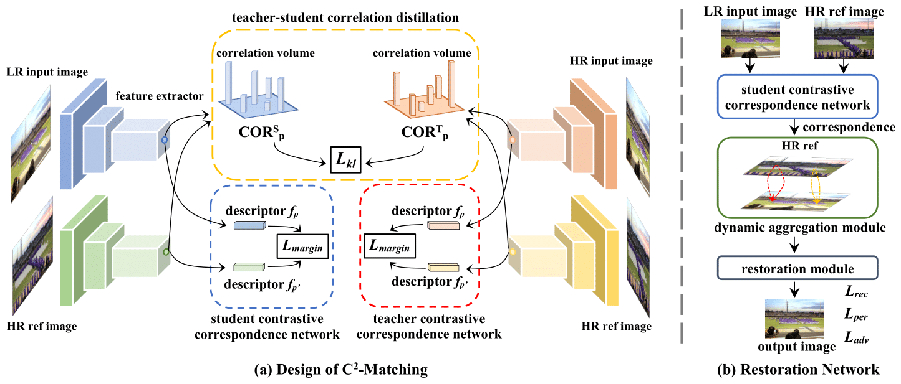
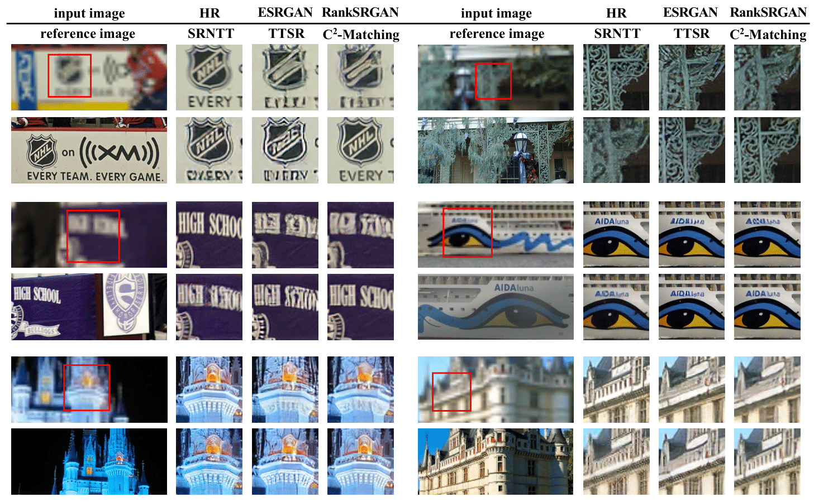

# C2-Matching (CVPR2021)


This repository contains the implementation of the following paper:
> **Robust Reference-based Super-Resolution via C2-Matching**<br>
> Yuming Jiang, Kelvin C.K. Chan, Xintao Wang, Chen Change Loy, Ziwei Liu<br>
> IEEE Conference on Computer Vision and Pattern Recognition (**CVPR**), 2021<br>

[[Paper](https://arxiv.org/abs/2106.01863)]
[[Project Page](https://yumingj.github.io/projects/C2_matching)]
[[WR-SR Dataset](https://drive.google.com/drive/folders/1Pt7blJA2cK4oQ6yWB9tcHerZ4pwICmxp?usp=sharing)]

## Overview



## Dependencies and Installation

- Python >= 3.7
- PyTorch == 1.9 
- CUDA 10.0 or CUDA 10.1
- GCC 5.4.0

1. Clone Repo

   ```bash
   git clone git@github.com:yumingj/C2-Matching.git
   ```

1. Create Conda Environment

   ```bash
   conda create --name c2_matching python=3.7
   conda activate c2_matching
   ```

1. Install Dependencies

   ```bash
   cd C2-Matching
   conda install pytorch=1.4.0 torchvision cudatoolkit=10.0 -c pytorch
   pip install mmcv==0.4.4
   pip install -r requirements.txt
   ```

1. Install MMSR and DCNv2

    ```bash
    python setup.py develop
    cd mmsr/models/archs/DCNv2
    python setup.py build develop
    ```


## Dataset Preparation

- Train Set: [CUFED Dataset](https://drive.google.com/drive/folders/1hGHy36XcmSZ1LtARWmGL5OK1IUdWJi3I)
- Test Set: [WR-SR Dataset](https://drive.google.com/drive/folders/16UKRu-7jgCYcndOlGYBmo5Pp0_Mq71hP?usp=sharing), [CUFED5 Dataset](https://drive.google.com/file/d/1Fa1mopExA9YGG1RxrCZZn7QFTYXLx6ph/view)

Please refer to [Datasets.md](datasets/DATASETS.md) for pre-processing and more details.

## Get Started

### Pretrained Models
Downloading the pretrained models from this [link](https://drive.google.com/drive/folders/1dTkXMzeBrHelVQUEx5zib5MdmvqDaSd9?usp=sharing) and put them under `experiments/pretrained_models folder`.

### Test

We provide quick test code with the pretrained model.

1. Modify the paths to dataset and pretrained model in the following yaml files for configuration.

    ```bash
    ./options/test/test_C2_matching.yml
    ./options/test/test_C2_matching_mse.yml
    ```

1. Run test code for models trained using **GAN loss**.

    ```bash
    python mmsr/test.py -opt "options/test/test_C2_matching.yml"
    ```

   Check out the results in `./results`.

1. Run test code for models trained using only **reconstruction loss**.

    ```bash
    python mmsr/test.py -opt "options/test/test_C2_matching_mse.yml"
    ```

   Check out the results in in `./results`


### Train

All logging files in the training process, *e.g.*, log message, checkpoints, and snapshots, will be saved to `./experiments` and `./tb_logger` directory.

1. Modify the paths to dataset in the following yaml files for configuration.
   ```bash
   ./options/train/stage1_teacher_contras_network.yml
   ./options/train/stage2_student_contras_network.yml
   ./options/train/stage3_restoration_gan.yml
   ```

1. Stage 1: Train teacher contrastive network.
   ```bash
   python mmsr/train.py -opt "options/train/stage1_teacher_contras_network.yml"
   ```

1. Stage 2: Train student contrastive network.
   ```bash
   # add the path to *pretrain_model_teacher* in the following yaml
   # the path to *pretrain_model_teacher* is the model obtained in stage1
   ./options/train/stage2_student_contras_network.yml
   python mmsr/train.py -opt "options/train/stage2_student_contras_network.yml"
   ```

1. Stage 3: Train restoration network.
   ```bash
   # add the path to *pretrain_model_feature_extractor* in the following yaml
   # the path to *pretrain_model_feature_extractor* is the model obtained in stage2
   ./options/train/stage3_restoration_gan.yml
   python mmsr/train.py -opt "options/train/stage3_restoration_gan.yml"

   # if you wish to train the restoration network with only mse loss
   # prepare the dataset path and pretrained model path in the following yaml
   ./options/train/stage3_restoration_mse.yml
   python mmsr/train.py -opt "options/train/stage3_restoration_mse.yml"
   ```

## Visual Results

For more results on the benchmarks, you can directly download our C2-Matching results from [here](https://drive.google.com/drive/folders/1-WE-f8XyG_MEZY77IGyS2le-UmDwhou9?usp=sharing).




## Webly-Reference SR Dataset

Check out our Webly-Reference (WR-SR) SR Dataset through this [link](https://drive.google.com/drive/folders/1Pt7blJA2cK4oQ6yWB9tcHerZ4pwICmxp?usp=sharing)! We also provide the baseline results for a quick comparison in this [link](https://drive.google.com/drive/folders/1EkKIznCzYrqH-YlAM_4UhyyMkd2tRlzz?usp=sharing).

Webly-Reference SR dataset is a test dataset for evaluating Ref-SR methods. It has the following advantages:
- Collected in a more realistic way: Reference images are searched using Google Image.
- More diverse than previous datasets.


## Citation

   If you find our repo useful for your research, please consider citing our paper:

   ```bibtex
   @inproceedings{jiang2021robust,
     title={Robust Reference-based Super-Resolution via C2-Matching},
     author={Jiang, Yuming and Chan, Kelvin CK and Wang, Xintao and Loy, Chen Change and Liu, Ziwei},
     booktitle={Proceedings of the IEEE/CVF Conference on Computer Vision and Pattern Recognition},
     pages={2103--2112},
     year={2021}
   }
   ```


## License and Acknowledgement

This project is open sourced under MIT license. The code framework is mainly modified from [BasicSR](https://github.com/xinntao/BasicSR) and [MMSR](https://github.com/open-mmlab/mmediting) (Now reorganized as MMEditing). Please refer to the original repo for more usage and documents.


## Contact

If you have any question, please feel free to contact us via `yuming002@ntu.edu.sg`.
